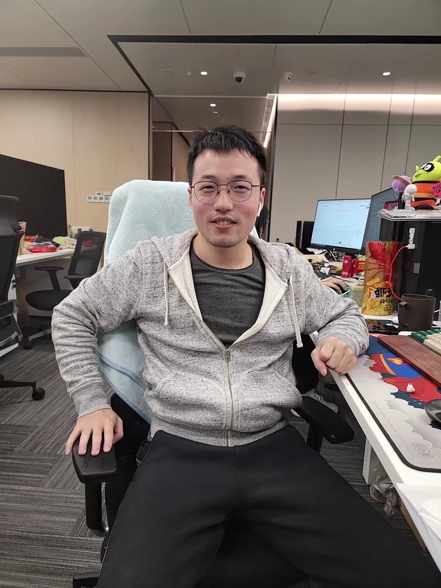
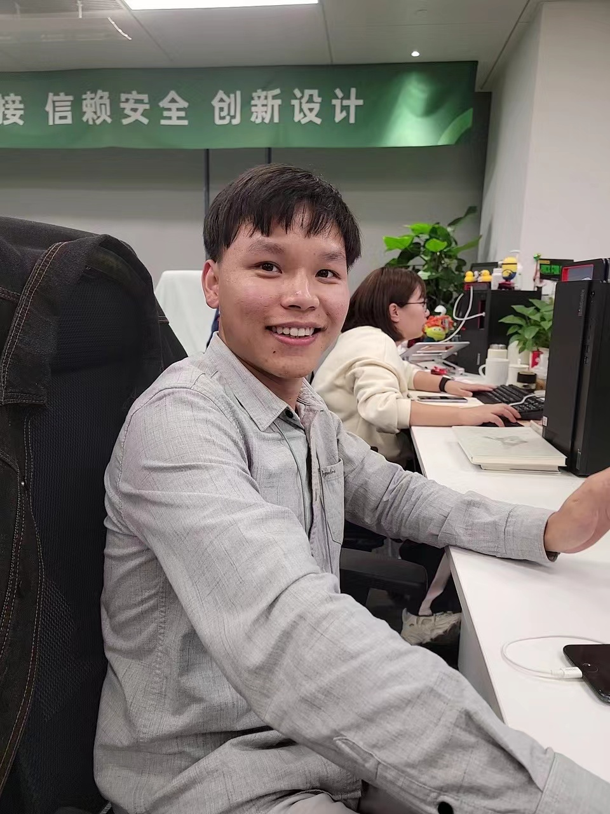

# AI人像时刻效果
## 定义
用研发现有用户会拍摄视频，然后人工从中选择高光帧，实现抓拍的效果  
人像时刻聚焦人像场景，如拍女朋友、亲子、聚会等场景，从视频中选择高光帧，给用户更便捷的拍照体验  
## 效果评价维度
|表情|视线|人脸质量|人像构图|
|-|-|-|-|
|1分|极端表情，表情扭曲|闭眼、斜视、眼部遮挡|很模糊|人像处于边角或极大极小|
|2-3分|表情呆滞，无表情或轻微负面表情|视线偏离，整体不突兀|人像存在模糊，但能看清|构图平庸，人像构图显得呆滞|
|4-5分|表情自然，情绪正面，人物开心|不闭眼，眼睛无遮挡，视线看镜头|人像主体突出且清晰|人像在画幅中位置适当，突出人像主体，构图和谐|

## 对比测试
|自研|三星|人工|
|-|-|-|
||||
||||
||||
||||