# 三维小物体重建效果

## 重建效果展示
|物体|前|后|
|:-:|:-:|:-:|
|
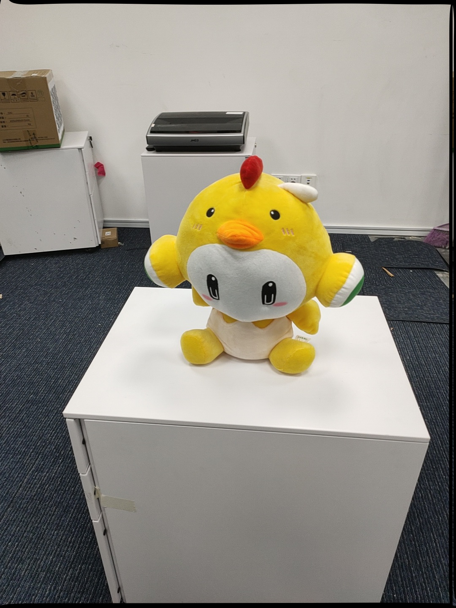
|
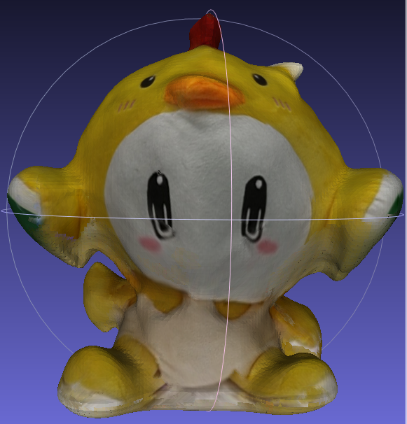
|
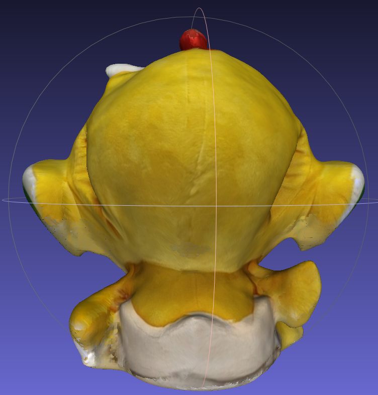
|
|
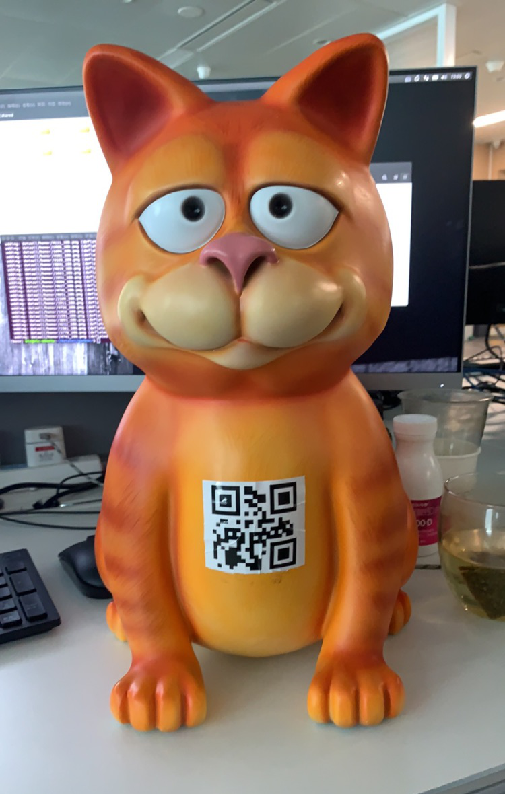
|
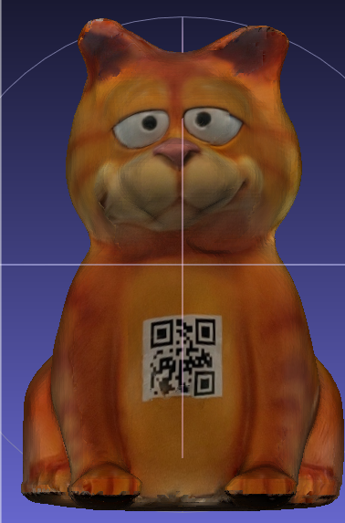
|
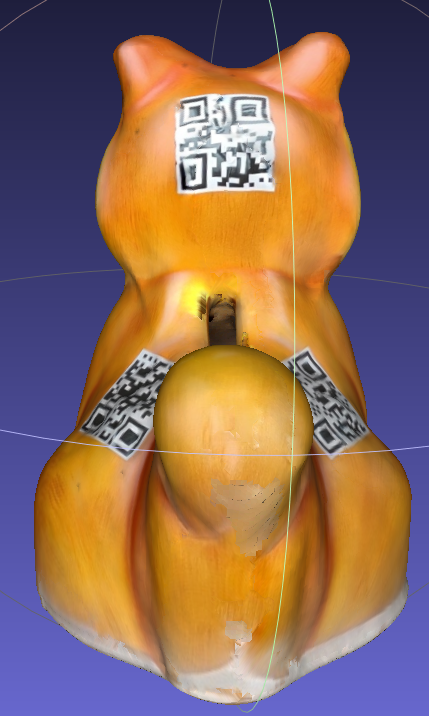
|
|

|
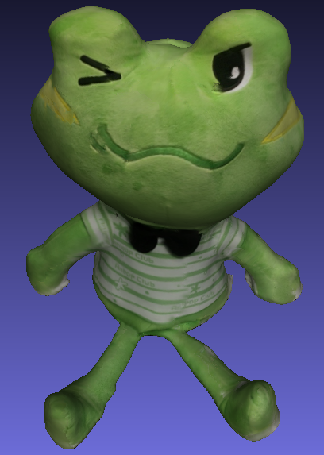
|
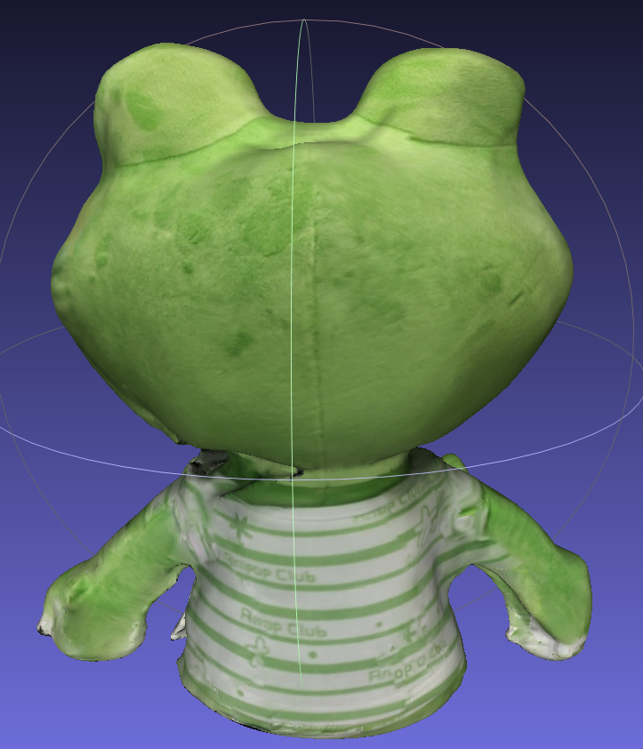
|

## 主观效果对比
|自研|友商A|友商B|
|:-:|:-:|:-:|
|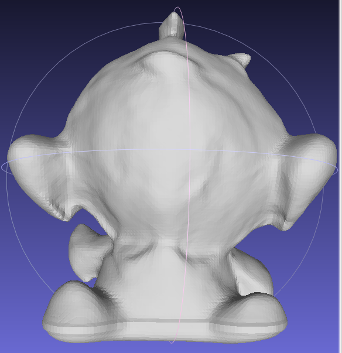|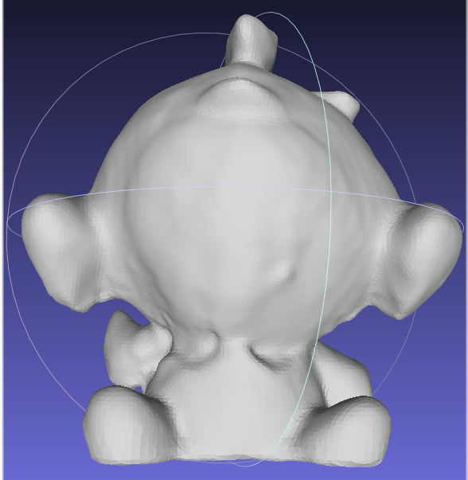|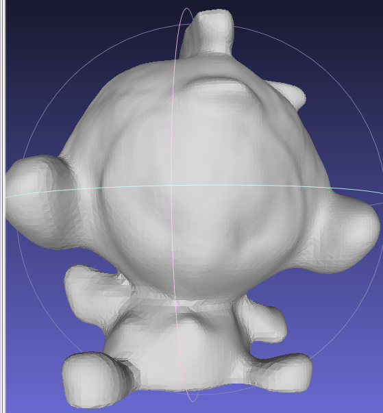|
||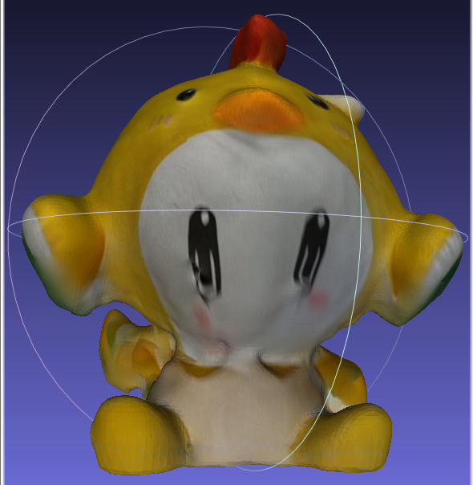|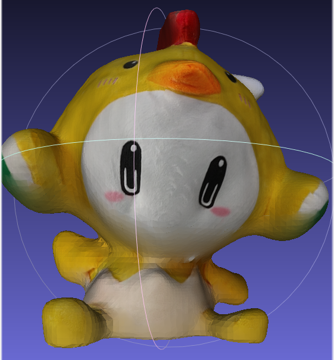|

## 客观评测
使用3D打印作为真值，计算的平均误差5.5mm，重建结果(黄色)与真值(蓝色)配准后点云如下图  
|打印模型|打印结果|重建对比|
|:-:|:-:|:-:|
|
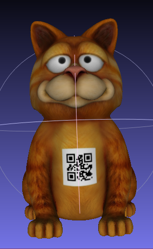
|

|
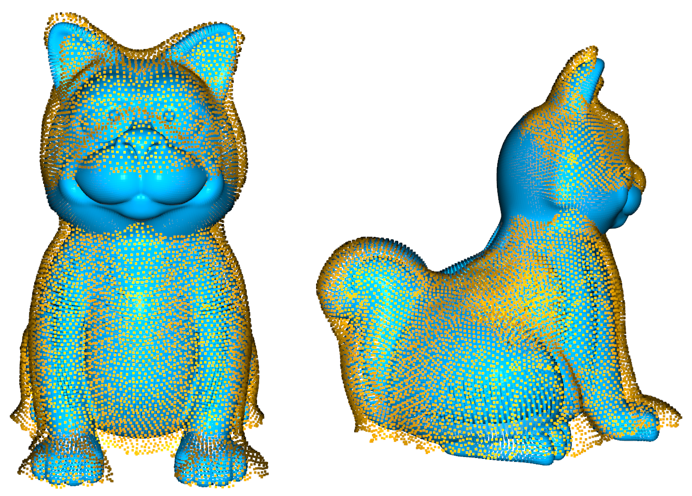
|