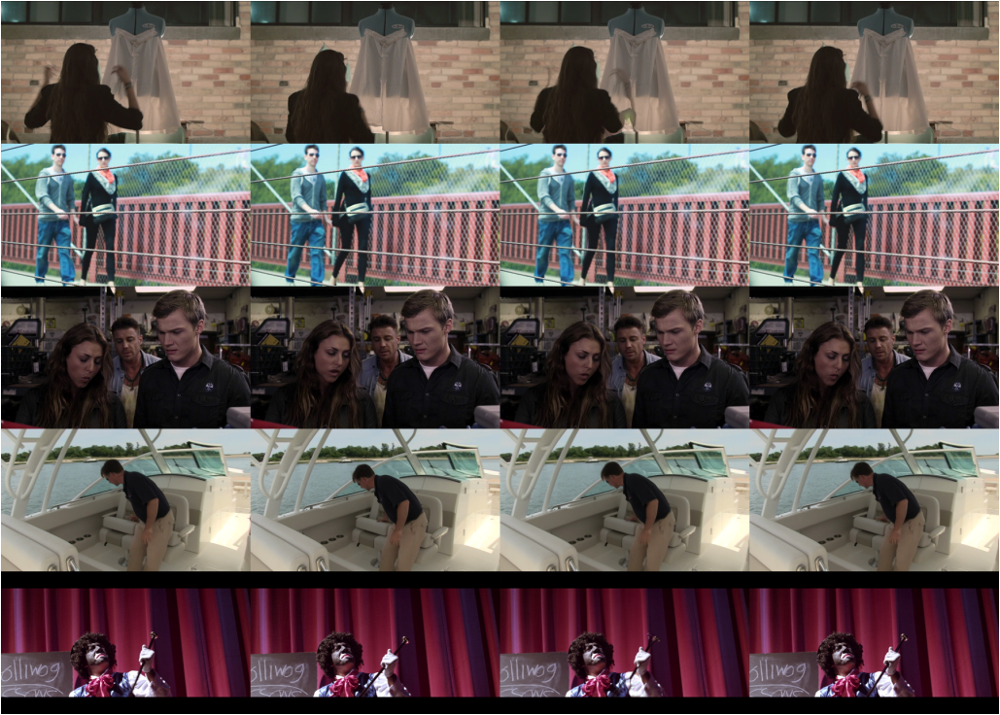
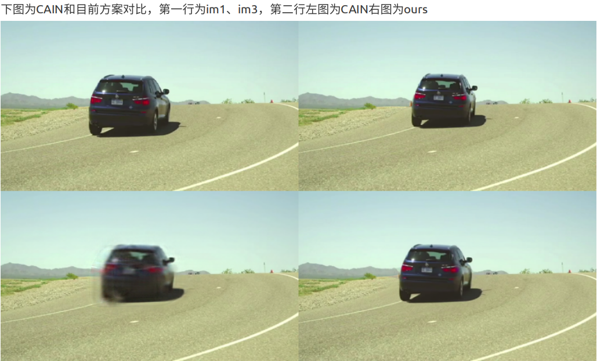
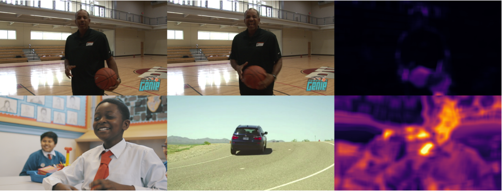
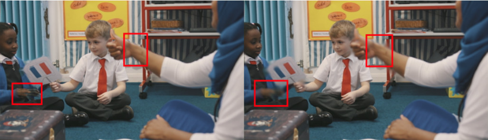

# 视频插帧效果

## 插帧示例
通过im1和im3生成im2，随机在验证集选取了5组结果，如下图，从左到右im1、im3、ours、groundtruth

## 对比开源方案
CAIN是AIM插帧亚军，是能找到的最好开源方案，在Vimeo90K测试集上PSNR34.6。对比较大运动情况，可以看到我们的方案更加清晰。

## 自检和缺陷矫正
在转场和运动过快的情况，插帧算法不可避免的出现failcase。我们的模型会同步输出像素级置信度，如下图颜色越深置信度越低。通过置信度可以识别转场，在此情况选择复制前帧。

对运动过快情况可以对局部模糊来提高主观感受，在视频播放时运动模糊不会引起主观不适。如下图。
